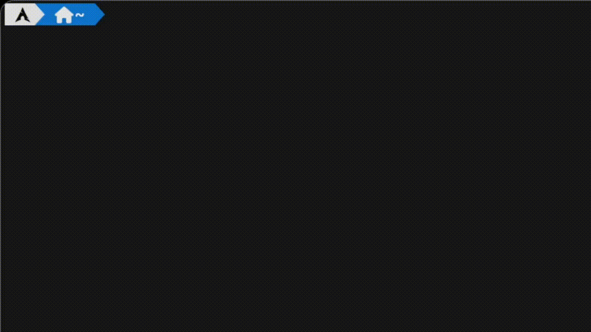

<br />
<div align="center">
  <h1 align="center">OSSD Mark Calculator</h3>

  <p align="center">
    🧮 Ontario Secondary School Diploma (OSSD) Mark Calculator CLI Tool
    <br />
    <br />
    <a href="https://github.com/udontur/ossd-mark-calculator/issues/new">Report Bug</a>
    ·
    <a href="https://github.com/udontur">Made with passion by Hadrian</a>
  </p>
</div>

## ⭐ About
```ossdmk``` is a command line tool that calculates your Ontario Secondary School Diploma marks using multiple marks, weights, and denominators in a fast and convenient way.

## 🛠️ Installation (Linux)
1. Add the Nix flake to your ```flake.nix```:
```nix
inputs = {
  ossdmk.url="github:udontur/ossdmk";
};
```
2. Add the package to your NixOS ```configuration.nix```:
```nix
environment.systemPackages = with pkgs; [
  inputs.ossdmk.default
];
```
3. Then rebuild your configuration:
```nix
nixos-rebuild switch --flake ./
```
## 🔧 Usage
Enter ```ossdmk``` in the terminal.
> [!NOTE]
> ```ossdmk``` can handle up to 3 decimal places.

## 💾 Demo

nix shell github:udontur/ossdmk -c ossdmk
